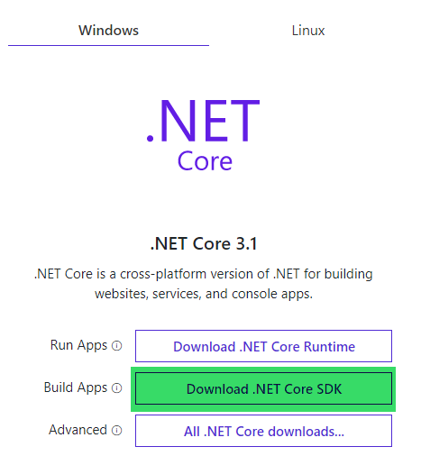
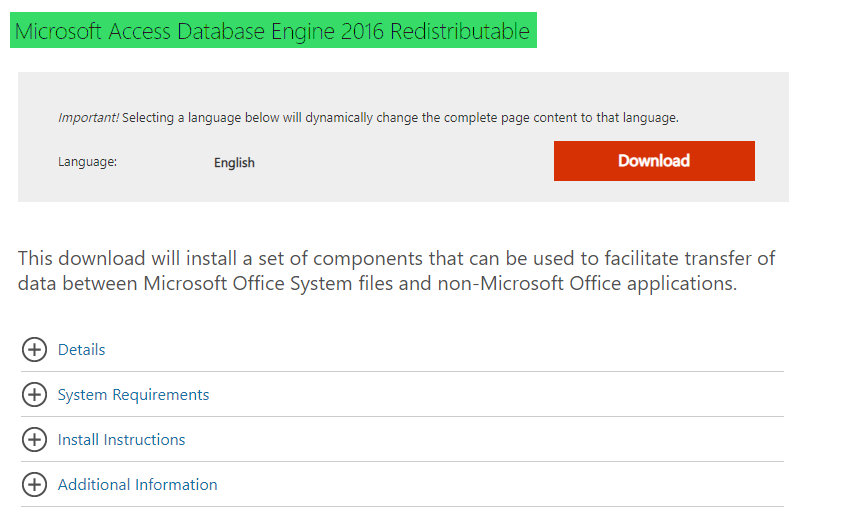

# 2.0 Prerequisites for running tests

## 1.  .NET Core SDK 3.1

You need to install .Net core before we start. We will then run the
tests using the PowerShell command.

**-\> Supported version of .NET is .NET Core 3.1**

Download and install **.NET Core SDK** from [this website](https://dotnet.microsoft.com/download).

## 2.  Microsoft Access Database Engine 2010 Redistributable

If you want to query the **excel files**, it is possible you got \'The
\'Microsoft.ACE.OLEDB.16.0\' provider is not registered on the local
machine.\' error message.

In this case it is necessary to install this provider from [this website](https://www.microsoft.com/en-us/download/details.aspx?id=54920).

[Previous chapter](1.0&#32;About&#32;JC.Unit.md) --- [Next chapter](3.0&#32;Set&#32;your&#32;first&#32;test.md) 

[Back to the List of Contents](0.&#32;List&#32;of&#32;Contents.md)  