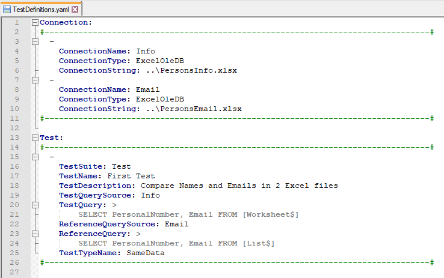
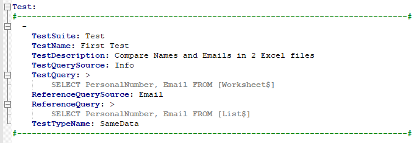
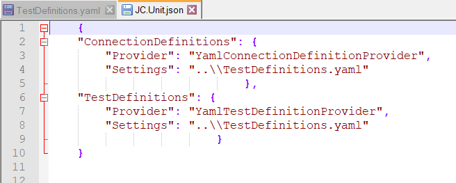
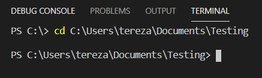
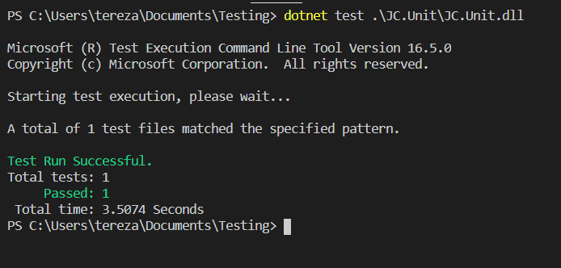
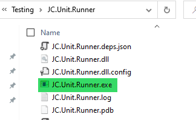

# 3.0 Set your first test

This chapter shows you how to run the first test - how to create a
Connection to the data set, how to write a test and then run it. Because
this lesson is an introduction to using JC.Unit, it does not use or
describe many of the options available for this tool.

**Prerequisities**

You will need the following to run the first test:
-   The JC.Unit folder
-   JC.Unit.Runner folder
-   JC.Unit.json file
-   Excel files with data
-   RunTest.ps1 file
-   TestDefinitions.yaml file

All of these files are part of the ['Sample files' folder](https://github.com/cernatery/JC.Tools/tree/main/JC.Unit/Documentation/SampleFiles).

Make sure you have .NET installed.

## Let\'s do the test

-   **Prepare two Excel files you want to test**

For the first test we chose to compare two excel files with data -
download these two files (PersonsInfo.xlsx & PersonsEmail.xlsx) and save them to the location where you have
the JC.Unit folder. In the Excel files there is data about 100 persons,
and we want to check that both files contain the same people\'s personal
numbers and their emails.

-   **Set content of the TestDefinitions.yaml**

The above example says we use YAML for defining tests and connections.
YAML is a language that is easy to read and easy to use. It is often
used as a format for configuration files.

In our example, tests and connections are defined in the same YAML file
called **TestDefinitions.yaml**.

Feel free to download this file [here](https://github.com/cernatery/JC.Tools/tree/main/JC.Unit/Documentation/SampleFiles).

In the picture below you can see what the basic setup for our first test
looks like. At the top of the file there is a place to define the
connections, at the bottom we will define our test.

### a. Let\'s define the connection

As you can see, in the **Connection section**, we define which two data
systems we want to connect to. We have to set three attributes -
ConnectionName, ConnectionType, ConnectionString.

First we choose **ConnectionName**. ConnectionName is used to
distinguish between different data sources. For the PersonInfo.xlsx file
let\'s choose name \"Info\", for PersonEmail.xlsx choose \"Email\".

For **ConnectionType** we choose ExcelOleDB because we have 2 excel files.

And finally **ConnectionString** - it represents the path to the file.

### b. Let\'s define the test

In the **Test section** we define all the attributes of the test - the
TestName, TestQuerySource, TestQuery, ReferenceQuerySource,
ReferenceQuery and TestTypeName.

The **name** of our test is simply \"First Test\", **TestSuite** can be
\"Test\" for exapmle, **TestDescription** is optional.

**TestQuerySource** and **ReferenceQuerySource** are the ConnectionNames
defined in the Connection section above - \"Info\" for PersonsInfo.xlsx
and \"Email\" for \"PersonsEmail.xlsx\".

TestQuery and ReferenceQuery fields contains test queries, in this case
to the Excel files.

We want to know if the data in the PersonalNumber and Email columns
match in both files.Writing a query to Excel file/sheet is not
complicated. In the \"from\" clause, we use the sheet name and in the
end write dollar sign. The name must be in square brackets e.g. select
count(\*) from \[sheet1\$\].

For the **TestTypeName** we choose the \"SameData\" option because we
test whether we have the same number of lines in both files.

### c. Setup JC.Unit.json

The last file we need to define is JC.Unit.json - JC.Units
[**configuration file**](https://github.com/joyfulcraftsmen/JC.Tools/tree/main/JC.Unit/Documentation/SampleFiles).

This file tells to JC.Unit where it should look for test definitions and
connection definitions - in this file we configure only two things:

-   Where should JC.Unit look for **definition of tests**.

-   Where should JC.Unit look for **definition of connections** (data sources) that are used in tests.

We have connections and tests defined in the same file -
**TestDefinition.yaml**.

This means that the provider for ConnectionDefinition will be
**YamlConnectionDefinitionProvider** and the provider for TestDefinition
will be **YamlTestDefinitionProvider**.

All providers require **Settings** field - it is a path to the file
containing the definitions, in our case it is a (relative) path to
TestDefinitions.yaml

### Ready to run the test?

#### a.  Running tests via PowerShell command

Let\'s say I have JC.Unit binaries and JC.Unit.json file in this
location:

> C:\\Users\\tereza\\Documents\\Testing

Start command line or PowerShell and navigate to that location:

Run command:
> dotnet test .\\JC.Unit\\JC.Unit.dll

#### b.  Running tests via JC.Unit.Runner

Let\'s say I have JC.Unit binaries and JC.Unit.json file in this
location:

> C:\\Users\\tereza\\Documents\\Testing

Open JC.Unit.Runner.exe from the JC.Unit.Runner folder

Now, all you need is to press the **RELOAD TESTS** button and the **RUN
TESTS** button.

The result will look like this:

[Previous chapter](2.0&#32;Prerequisites.md) --- [Next chapter](4.0&#32;How&#32;to&#32;run&#32;test-suite.md)

[Back to the List of Contents](0.&#32;List&#32;of&#32;Contents.md)  