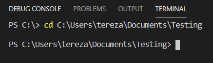
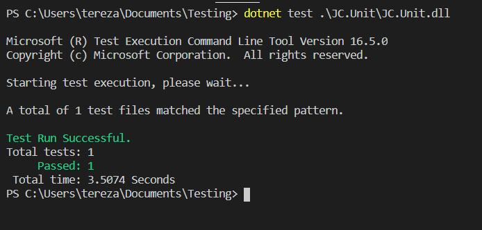
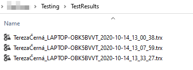

# 4.1 How to run test-suite locally in Command line

Testers usually need to run their tests locally on their client
machines, not only from Azure DevOps or TFS pipelines.

It speeds up test development and lots of things can be checked before
running build a pipeline.

**Prerequisities**

Make sure you have .NET installed.

**How to run tests**

Let\'s say I have JC.Unit binaries and JC.Unit.json file in this
location:

> C:\\Users\\tereza\\Documents\\Testing

Start command line or PowerShell and navigate to that location:

Run command:
> dotnet test .\\JC.Unit\\JC.Unit.dll

Basically, you can run the command from anywhere, if you provide correct
path to the JC.Unit.dll file.

**Other options for running JC.Unit in cmd:**

-   Tests execution & Creating a TestResults folder with test results in .trx format in the directory from which we run JC.Unit, just run the following command:

> dotnet test .\\JC.Unit\\JC.Unit.dll /logger:trx

-   Tests execution & Creating a file folder in .trx format in a directory that we choose

> dotnet test .\\JC.Unit\\JC.Unit.dll /logger:trx /ResultsDirectory:C:\\Users\\TerezaČerná\\Documents\\Projects\\Testing

[Previous chapter](4.0-How-to-run-test-suite.md)  --- [Next chapter](4.2-How-to-run-test-suite-locally-using-JC.Unit.Runner.md)

[Back to the List of Contents](0-0-list-of-contents)  