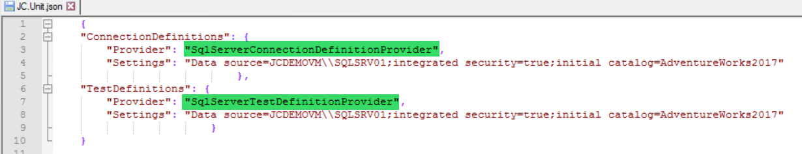

# 5.0 How to setup the JC.Unit.json file

JC.Unit.json is a json file that stores the paths to the **connections**
and **tests** you wrote. It is a JC.Units **configuration file**. In
this subchapter we will explain the details.

Two parts must be configured in the JC.Unit.json file:

-   A \"ConnectionDefinitions\" part: It tells JC.Unit where should look for **definitions of connections** (data sources) that are used in tests.
-   A \"TestDefinitions\" part: Where should JC.Unit look for **definitions of tests**.
-   A \"MaximumErrorCount\" part (optional):

The number of rows that appear in the error message if an error occurs.

MaximumErrorCount = 1, ends on the first error.
MaximumErrorCount = 0 means that it does not end, even goes through both
datasets and finds all the differences (the test execution may took a
lot of time).
MaximumErrorCount = 9 means that it will end after nine differences,
even if more are needed. Of course, if there are fewer of them, they
will end.

**An important note:**

JC.Unit looks for the file in the folder one level above the
JC.Unit.dll. It is possible to easily replace the entire content of
JC.Unit folder (you can use different name) with a newer version,
without losing configuration file.

## A.  \"ConnectionDefinitions\" part

The \"**Provider**\" field specifies the format in which the ConnectionDefinition file is saved - it tells JC.Unit what type of file should look for.

Supported providers for connections:

  |**Name of the Provider**                | **Description**|
  |----------------------------------------|----------------------------------------------------------------------------------------------------|
  |ExcelConnectionDefinitionProvider       | Used for Connections stored in Excel file.|
  |ExcelOleDBConnectionDefinitionProvider  | Used for Connections saved in Excel file (requires Access database engine driver to be installed).|
  |SqlServerConnectionDefinitionProvider   | Used for Connections stored in the MS SQL database.|
  |YamlConnectionDefinitionProvider        | Used for Connections stored in YAML file.|
  
  
It is important to keep names convention e.g. \"ExcelConnectionDefinitionProvider\"
  

All providers require \"**Settings\"** field. For excel, excel OleDB and YAML, it is a path to the file containing the definitions.

> \"Settings\": \"..\\Tests.xlsx\"

SqlServer provider requires a connection string in the Settings field:

> \"Settings\": \"Data source=SomeServer;integrated security=true;initial catalog=MyDatabase\"

## B.  \"TestDefinitions\" part

The \"**Provider**\" field specifies the format in which the TestDefinition file is saved - it tells JC.Unit what type of file should look for.

Supported providers for Tests are the same as for Connections:

  |**Name of the Provider**          | **Description**|
  |----------------------------------|----------------------------------------------------------------------------------------------------|
  |ExcelTestDefinitionProvider       | Used for Connections stored in Excel file.
  |ExcelOleDBTestDefinitionProvider  | Used for Connections saved in Excel file (requires Access database engine driver to be installed).|
  |SqlServerTestDefinitionProvider   | Used for Connections stored in the MS SQL database.|
  |YamlTestDefinitionProvider        | Used for Connections stored in YAML file.|

It is important to keep names convention e.g. \"ExcelTestDefinitionProvider\"

As with Connections, the Test requires a Settings field.

**Examples:**

-   **SqlServerConnectionDefinitionProvider** and **SqlServerTestDefinitionProvider** in JC.Unit.json file

-   **ExcelOleDBConnectionDefinitionProvider** and **ExcelOleDBTestDefinitionProvider** in JC.Unit.json file

-   **YamlConnectionDefinitionProvider** and **YamlTestDefinitionProvider** in JC.Unit.json file

[Previous chapter](4.3-How-to-run-test-suite-in-the-pipeline.md)  --- [Next chapter](6.0-How-to-define-a-Connection-Definitions.md) 

[Back to the List of Contents](0-0-list-of-contents)  