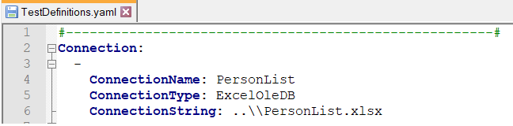
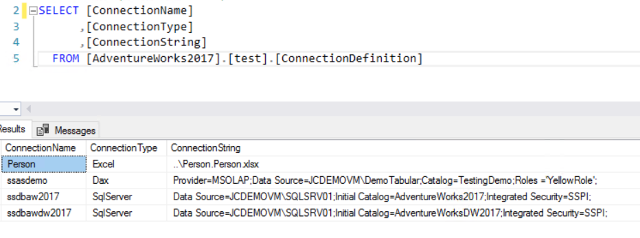
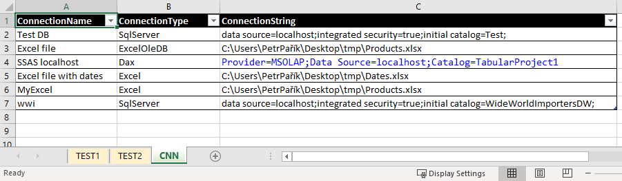
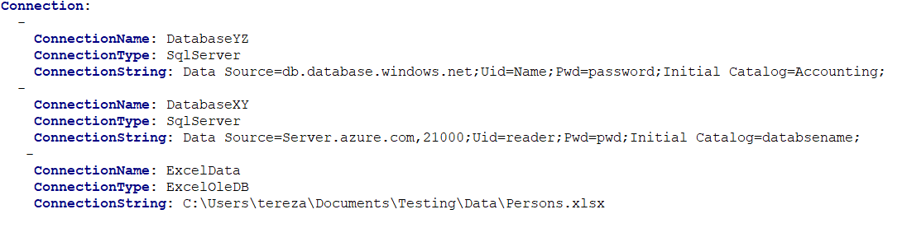

# 6.0 How to define a Connection Definitions

Connections are used to connect to the data you want to test. In this
subchapter we will look at what **attributes** Connections have and how
to define them correctly.

Connections can be defined in Excel, YAML or in the table in the MS SQL
database.

When you want to connect to data files, you must define three attributes
- ConnectionName, 
- ConnectionType,
- ConnectionString.

Here you can find a description of the attributes:

| **Attribute**    | **Description**                 | **Mandatory** |
|------------------|---------------------------------|---------------|
| ConnectionName   | You choose the ConnectionName yourself - it is the name for the query source. This is used in the definitions of the tests. The ReferenceQuerySource and TestQuerySource can contain only values defined here in ConnectionName.   | Yes           |
| ConnectionType   | You choose the ConnectionType attribute based on where your data are stored. You can select one of the following types: Excel, ExcelOleDB, SqlServer, Yaml, Oracle, Postgres, Dax Find details in the 'Various Connection Types' chapter | Yes           |
| ConnectionString | For Excel, ExcelOleDB and Yaml this contains path to the file. For SqlServer, Oracle, Dax and Posgres, this contains connection string.   | Yes           |

In Excel file and in the Table in MS SQL database, one row represents
one Connection definition. In the case of Yaml file, each Connection
definition begins with a hyphen. See examples below.

**Examples:**

You can define Connections in an Excel file, in YAML, or in a table in
MS SQL database. Below you can see some examples of what the file with
Connection Definitions might look like.

-   Connections stored in MS SQL database

-   Connections stored in Excel

-   Connections stored in YAML

[Previous chapter](5.0&#32;How&#32;to&#32;setup&#32;the&#32;JC.Unit.json&#32;file.md) --- [Next chapter](6.1&#32;Various&#32;Connection&#32;types.md) 

[Back to the List of Contents](0.&#32;List&#32;of&#32;Contents.md)  