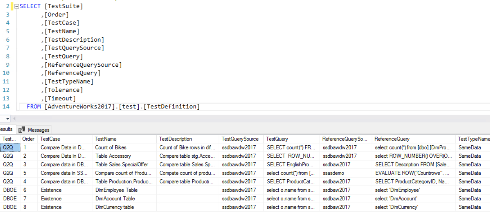
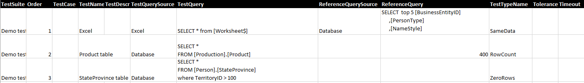
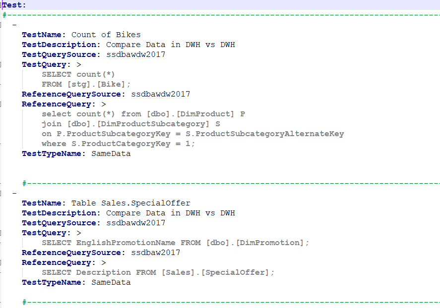

# 7.0 How to define tests

In this subchapter we will show you how to write a test correctly. Each
test has several attributes, which will be presented here.

Each test has several Attributes that must always be defined, the others
are optional. Here is an overview of them:

| **Attribute**        | **Description**      | **Mandatory**        |
|----------------------|----------------------|----------------------|
| TestSuite            | Optional. A name which is used for grouping test cases together. | No |
| Order                | Optional. Integer value is expected. | No |
| TestCase             | Optional. A test case is a specification of the inputs, execution conditions, testing procedure etc. | No |
| TestName             | Does not need to be unique. Combination of TestSuite, Order, TestCase and TestName has to be unique | Yes |
| TestDescription      | Optional. Description of the test. | No |
| TestQuerySource      | One of the values defined in ConnectionName  | Depends on TestTypeName |
| TestQuery            | A command (e.g. SQL, DAX, …) that can by understand by the given connection type. Or expected value for some test types. | Depends on TestTypeName |
| ReferenceQuerySource | One of values defined in ConnectionName | Depends on TestTypeName |
| ReferenceQuery       | A command (e.g. SQL, DAX, …) that can by understand by the given connection type.  | Depends on TestTypeName |
| TestTypeName         | SameData, RowCount or ZeroRows. Or other type of tests implemented in future. | Yes |
| Tolerance            | You can set how much the two values can differ. | No |
| Timeout              | Timeout in seconds. | No |

In Excel file and in the Table in MS SQL database, one row represents
one test. In the case of Yaml file, each test begins with a hyphen. See
examples below.

**Examples:**

-   TestDefinitions in **MS SQL database**:

-   TestDefinition in **Excel file**:

-   TestDefinition in **YAML**:

[Previous chapter](6.2-Where-to-store-Connections.md) --- [Next chapter](7.1-Various-Test-types.md) 

[Back to the List of Contents](0-0-list-of-contents)  