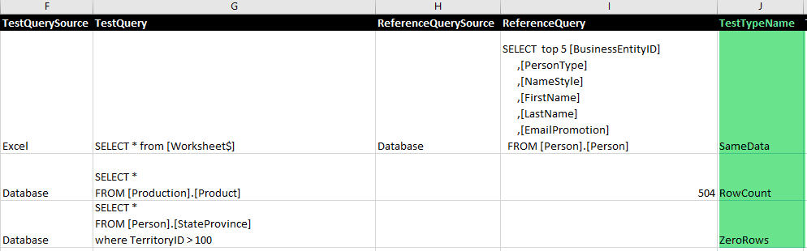

# 7.1 Various Test types

One of the mandatory attributes in a test definition is the
TestTypeName attribute. This subchapter describes the three types of
tests that JC.Unit supports.

**TestTypeName must be declared for each test.**

JC.Unit supports the following types of tests:

-   SameData
-   RowCount
-   ZeroRows

## SameData

This test compares that the results of both queries are the same - the test will iterate through both result sets.

This test requires all the fields specified (TestQuerySource, TestQuery, ReferenceQuerySource and ReferenceQuery).
It will fail if any value in the result set is different.

## RowCount

This test compares whether a data source has a certain number of rows.
In **TestQuery**, put the SQL, DAX or whatever query that returns rows.
In **ReferenceQuery**, put the expected number of rows (just simple integer).

The test will pass, if the number of rows is equal to the expected number.

## ZeroRows

This test is used if we expect the result of our query to be an empty table.
There must be only **TestQuerySource** and **TestQuery** to be
specified. The test will pass only if the returned result set contains
no rows.

**Example:**

[Previous chapter](7-0-how-to-define-a-test-definitions) --- [Next chapter](7-2-where-to-store-tests)

[Back to the List of Contents](0-0-list-of-contents)  