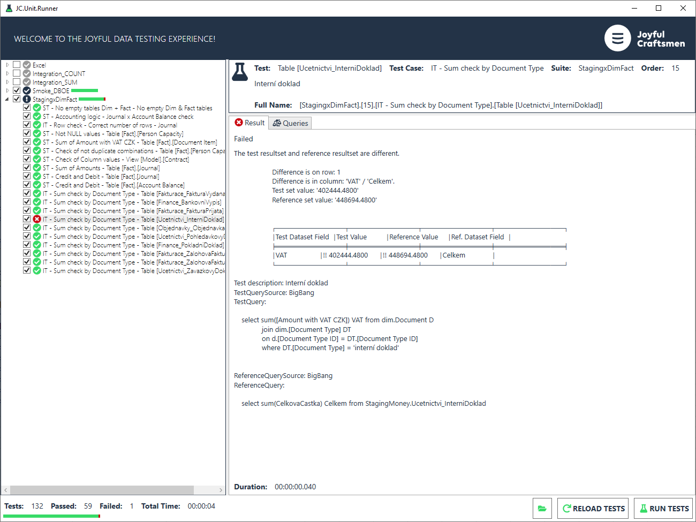

# 8.0 JC.Unit.Runner

Runner is a tool used to run tests and for easy debugging. It also shows
how many tests were run in total and the total time for how long the
tests were executed.

It is located in the JC.Unit.Runner folder, just open the .exe file.

The runner reads the **JC.Unit.json** configuration file and looks for
tests according to the path defined there.

JC.Unit.json should therefore be placed one level above JC.Unit.Runner.

After opening the JC.Unit.Runner, all you have to do is to click on
RELOAD TESTS button.

The advantage of Runner is easy orientation - tests are divided into
groups according to Test Suites. When we open Test Suites, we will see
the individual tests.

When tests are loaded select which tests you want to execute (it can be
a single test), then click on the RUN TESTS button.

Failed tests are marked in red. Error details are available in the
**Results** bookmark. In the **Queries** bookmark it is possible to copy
queries for easy debugging.

[Previous chapter](7.2-Where-to-store-Tests.md) --- [Next chapter](9.0-Tips&Tricks.md)

[Back to the List of Contents](0-0-list-of-contents)  