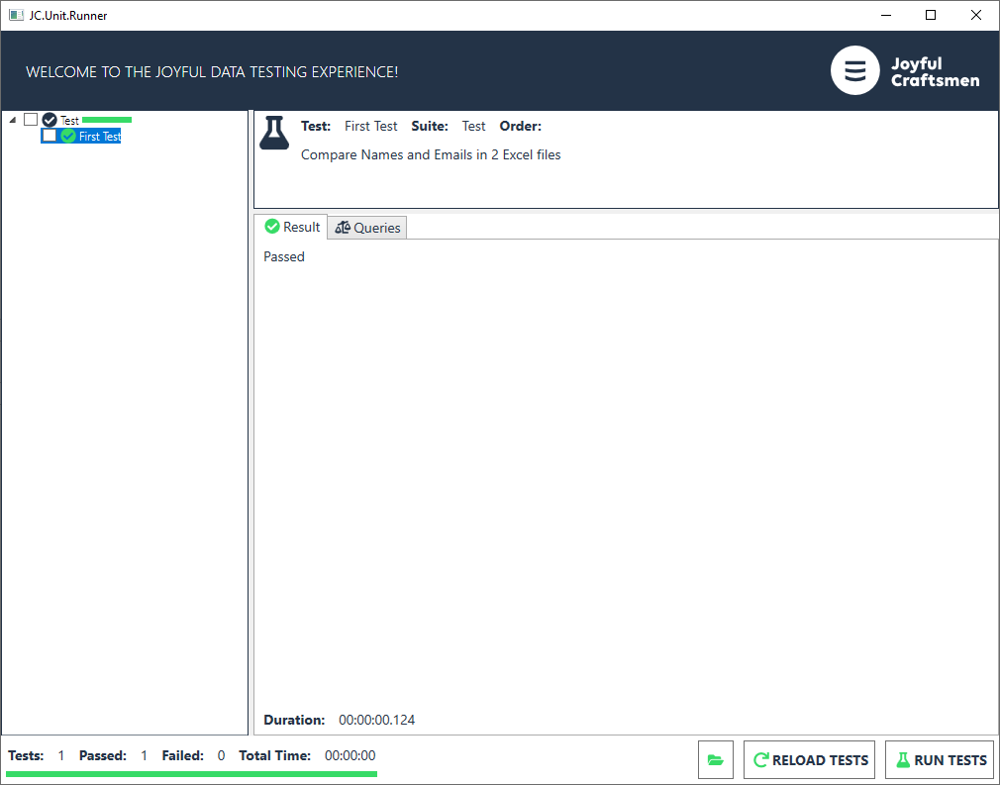

# 4.2 How to run test-suite locally using JC.Unit.Runner

Testers usually need to run their tests locally on their client
machines, not only from Azure DevOps or TFS pipelines.

It speeds up test development and lots of things can be checked before
running build a pipeline.

**Prerequisities**

Make sure you have .NET installed.

**How to run tests**

Let\'s say I have JC.Unit binaries and JC.Unit.json file in this
location:

C:\\Users\\tereza\\Documents\\Testing

Open JC.Unit.Runner.exe from the JC.Unit.Runner folder

Now, all you need is to press the **RELOAD TESTS** button and the **RUN
TESTS** button.

The result will look like this:

[Previous chapter](4.1&#32;How&#32;to&#32;run&#32;test-suite&#32;locally&#32;in&#32;Command&#32;line.md) --- [Next chapter](4.3&#32;How&#32;to&#32;run&#32;test-suite&#32;in&#32;the&#32;pipeline.md) 

[Back to the List of Contents](0.&#32;List&#32;of&#32;Contents.md)  