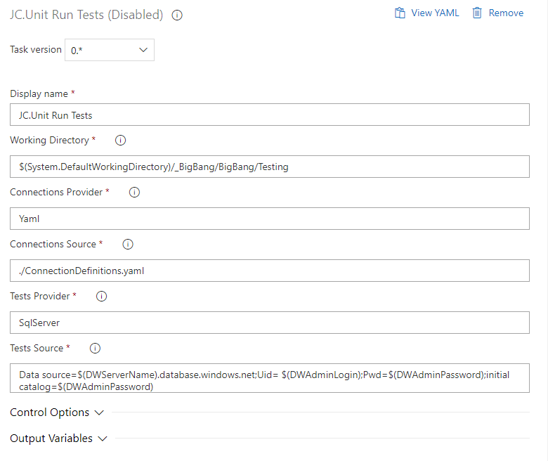
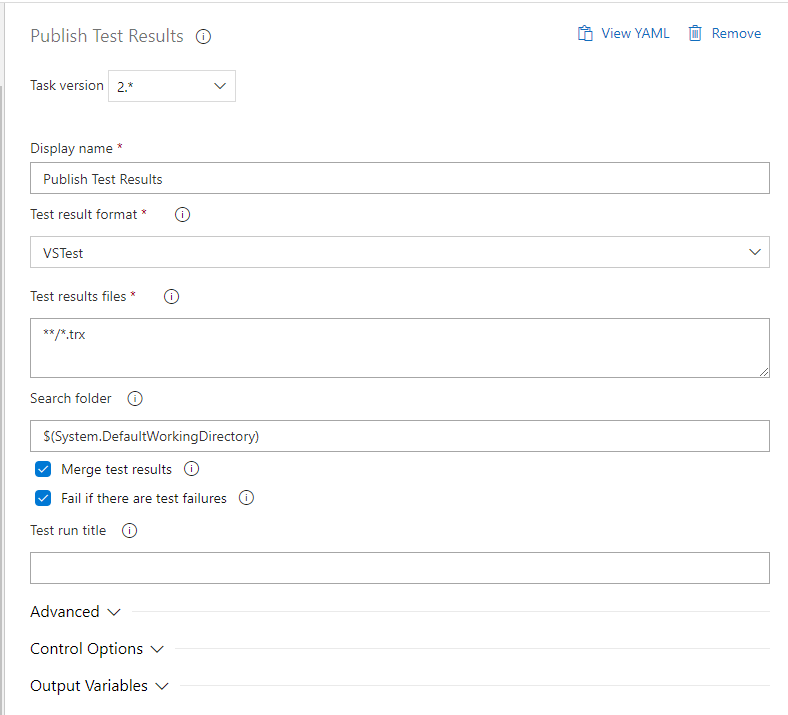

# 4.3 How to run test-suite in the pipeline

We have a custom AzureDevops extension with JC.Unit custom task. You can
use it in any pipeline in JC tenant.

If you want to use it in other organizations DevOps pipelines, the
extension needs to be first **shared by JC**.

To use the extension, you need to add 2 tasks:
-   JC.Unit Run Tests task
-   Publish Test Results task

**Important note:** The JC.Unit Run Tests task requires that the .NET
Core SDK 3.1 be installed on the server on which the agent is running
before executing the test.

JC.Unit Run Tests task example:

Use the (i) icons (hover over it), it contains useful help messages.

The JC.Unit Run Tests tasks only runs tests, but does not publish its
results to the pipeline, this needs to be done in a separate task:

Make sure you selected \"VSTdest\" and provided \"\*\*/\*.trx\" values,
as on the picture. These are not default values. Usually you will also
want to fail the pipeline if tests fail, check \"Fail if there are test
failures\".