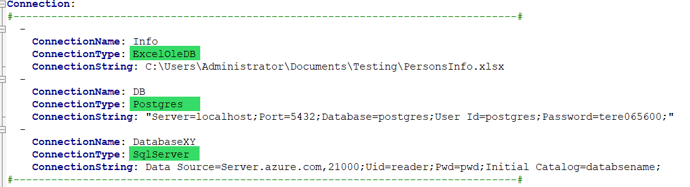

# 6.1 Various connection types

JC.Unit can test various data sources. In this subchapter you will learn
what types of connections we can use for testing.

When you want to connect to data file, you must define three attributes
- ConnectionName, 
- ConnectionType, 
- ConnectionString.

Let\'s take look at the attribute **ConnectionType**.

The ConnectionType is selected according to the data source to which you
want to connect.

Supported providers for connections:

| **ConnectionType** | **Description** | **Connection string**| **An Example** |
|----------------|----------------|----------------|----------------|
| Excel | Is used for connection to Excel file. This connection is selected only if a simple query is performed in TestQuery/ReferenceQuery e.g. SELECT * FROM MyExcelSheet, or SELECT Column1, Column2 FROM MyExcelSheet. ConnectionString is a path to the file. | [Path to the excel file] or [Relative path to the excel file] | C:\Users\TerezaCerná\Documents\JC.Unit\PersonsInfo.xlsx or ..\PersonsInfo.xlsx|
| ExcelOleDB | Is used for connection to Excel file. This connection is selected if more complex queries, aggregate functions, conditions, etc. are performed in TestQuery/ReferenceQuery. The name of the sheet we are querying must be in square brackets and must end with a dollar sign - for example: SELECT count(*) FROM [MyExcelSheet$]. ConnectionString is a path to the file.   | [Path to the excel file] or [Relative path to the excel file] | C:\Users\TerezaCerná\Documents\JC.Unit\PersonsInfo.xlsx or ..\PersonsInfo.xlsx |
| SqlServer | Is used for connection to the MS SQL database. ConnectionString is a Connection string to the MS SQL database. | Data Source=[Server Name];Integrated security=[True/False];Initial Catalog=[Database Name]; or Data Source=[Server Name];Uid=[User Name];Pwd=[Password];Initial Catalog=[Database Name]; | Data Source=demoserver.database.windows.net;Integrated Security=True;Initial Catalog=TestDatabase; or Data Source=demoserver.database.windows.net;Uid=User123;Pwd=Password123;Initial Catalog=TestDatabase;|
| Oracle | Is used for connection to the Oracle database. ConnectionString is a Connection string to the Oracle database. | Data Source=(DESCRIPTION = (ADDRESS = (PROTOCOL = TCP)(HOST = [Host name])(PORT = [Port Number])) (CONNECT_DATA = (SERVER = DEDICATED) (SERVICE_NAME = [Database Name])));User Id=[User];Password=[Password];Persist Security Info=[True/False]; | Data Source=(DESCRIPTION = (ADDRESS = (PROTOCOL = TCP)(HOST = DATA1.DEMO.COM)(PORT = 1521)) (CONNECT_DATA = (SERVER = DEDICATED) (SERVICE_NAME = DWHDemo)));User Id=User123;Password=Password123;Persist Security Info=True;|
| Dax | Is used for connection to Tabular. ConnectionString is a Connection string to the Tabular. | Provider=MSOLAP;Data Source=[Server Name];Initial Catalog=[Database Name]; or Provider=MSOLAP;Data Source=[Server Name];Initial Catalog=[Database Name];EffectiveUserName=[Log as a specific user] | Provider=MSOLAP;Data Source=czdem007\tabular;Initial Catalog=DemoTab; or Provider=MSOLAP;Data Source=czdem007\tabular;Initial Catalog=DemoTab;EffectiveUserName = "User\XXX123" |
| Postgres | Is used for connection to the PostgreSQL database. ConnectionString is a Connection string to the PostgreSQL database. | Host=[Host Name];port=[Port Number];dbname=[Database Name];connect_timeout=10 | Host=localhost;port=5432;dbname=postgres;connect_timeout=10 |
| Pbix | Is used for connection to the Power BI Desktop datasets. Connection string is a name of the opened Power BI desktop report. Power BI report which you want to test must be opened! | [Name of the opened Power BI file] | My Demo Report |