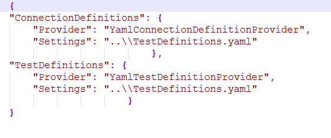
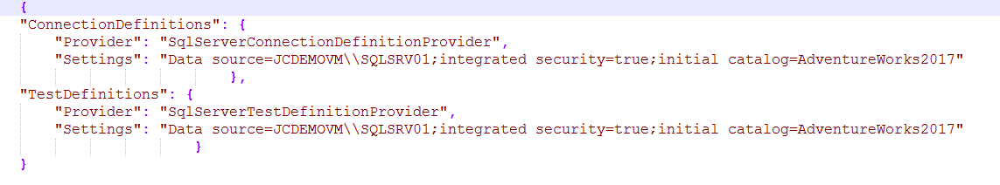

# 6.2 Where to store connections

Connections that we define can be stored in Excel file, YAML file or in
a table in SQL Server database.

Depending on where the definitions are stored, we choose the key
\"**Provider**\", which is in the \"configuration file\" **JC.Unit.json**.

Under the \"**Settings**\" key is then the path to the file where the connections are stored.

Therefore, if you have a connection defined in the table in MS SQL database, you will use SqlServerConnectionDefinitionProvider and Connection string to the database.

**Supported providers for connections:**

  |             |**Provider name**                        |**Description**|
  |------------ |---------------------------------------- |--------------------------------------------------------------------------------------------------------|
  |Excel file   |ExcelConnectionDefinitionProvider        |Used for definitons declared in Excel file.|
  |Excel file   |ExcelOleDBConnectionDefinitionProvider   |Used for definitons declared in Excel file, but requires Access database engine driver to be installed.|
  |SQL Server   |SqlServerConnectionDefinitionProvider    |Used for definitons declared in MS SQL database.|
  |Yaml file    |YamlConnectionDefinitionProvider         |Used for definitons declared in YAML file.|

**Examples:**

-   Use of a **ExcelConnectionDefinitionProvider**

 
-   Use of a **YamlConnectionDefinitionProvider**

-   Use of a **SqlServerConnectionDefinitionProvider**

