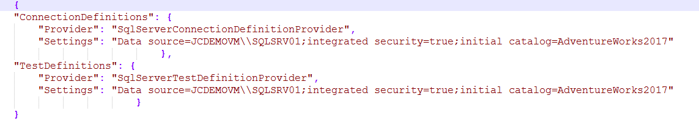
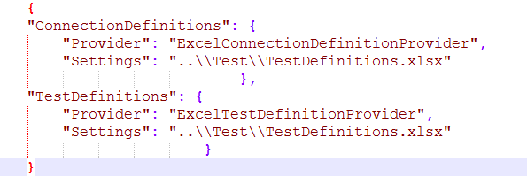
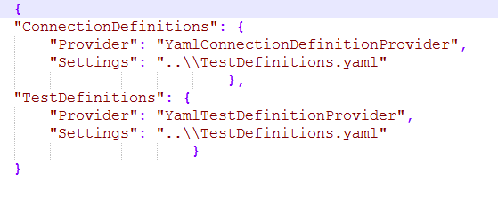

# 7.2 Where to store tests

Tests that we write can be stored in Excel file, YAML file or in a table
in MS SQL database.

Depending on where the tests are stored, we choose the key
\"**Provider**\", which is in the **JC.Unit.json** file.

In the \"**Settings**\" key is then the path to the file where the tests
are stored.

**Supported providers for tests:**

|                   | **Provider name**                       | **Description**|
| ----------------- |----------------------------------------  |--------------------------------------------------------------|
| Excel file        | ExcelConnectionDefinitionProvider        | Used for definitons declared in Excel file.|
| Excel file        | ExcelOleDBConnectionDefinitionProvider   | Used for definitons declared in Excel file, but requires Access database engine driver to be installed.|
| MS SQL database   | SqlServerConnectionDefinitionProvider    | Used for definitons declared in MS SQL database.|
| Yaml file         | YamlConnectionDefinitionProvider         | Used for definitons declared in YAML file.|

 
Which provider is used for loading our tests is defined in \"configuration file\" (JC.Unit.json) - under \"**Provider**\" key.

Don\'t forget to set also proper \"connection string\" under \"**Settings**\" key.

**Examples:**

-  Use of a **SqlServerTestDefinitionProvider**

-   Use of a **ExcelTestDefinitionProvider**

{width="4.958333333333333in"
height="1.65625in"}

-   Use of a **YamlTestDefinitionProvider**

