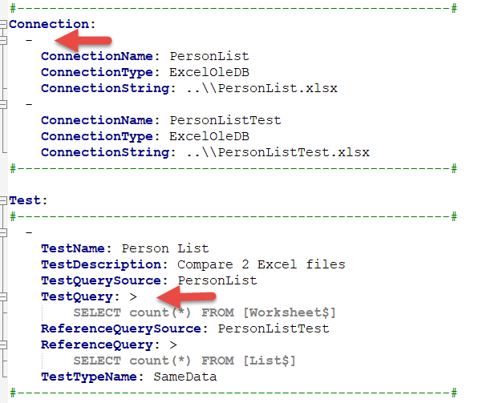

# 9.0 Tips & Tricks

## More information about YAML

This provider is most comfortable to work with.

Especially queries spanning more lines are easy editable. The file
should have .yaml extension. Install YAML extension in VS code for easy
editing.

I recommend you read this blog post to get familiar with YAML:
[[https://blog.stackpath.com/yaml/]{.ul}](https://blog.stackpath.com/yaml/)

 
**Important YAML formatting**

When writing tests in YAML, make sure you don\'t forget the **hyphen**
at the beginning of the line, or the

**inequality sign** when writing the query (this sign ensures that a
value that is contained on multiple lines is read).

## Create ConnectionDefinition Table in the database

If you want to have a connection definitions defined in the database use
following SQL script.

At first it is necessary to create schema Test in the database. Name of
the table must be \"ConnectionDefinition\".

> CREATE TABLE \[Test\].\[ConnectionDefinition\]  
> (  
> \[ConnectionName\] \[NVARCHAR\](200) NOT NULL PRIMARY KEY CLUSTERED,  
> \[ConnectionType\] \[NVARCHAR\](200) NOT NULL,  
> \[ConnectionString\] \[NVARCHAR\](2000) NOT NULL  
> );  

##  Create TestDefinition Table in the database

If you want to have a test definitions defined in the database use
following SQL script.

At first it is necessary to create schema Test in the database. Name of
the table must be \"TestDefinition\".

> CREATE TABLE \[Test\].\[TestDefinition\]  
> (  
> \[TestSuite\] NVARCHAR(300) NULL,  
> \[Order\] INT NULL,  
> \[TestCase\] NVARCHAR(300) NULL, 
> \[TestName\] NVARCHAR(300) NOT NULL,  
> \[TestDescription\] NVARCHAR(MAX) NULL,  
> \[TestQuerySource\] NVARCHAR(200) NULL,  
> \[TestQuery\] NVARCHAR(MAX) NULL,  
> \[ReferenceQuerySource\] NVARCHAR(200) NULL,  
> \[ReferenceQuery\] NVARCHAR(MAX) NULL,  
> \[TestTypeName\] VARCHAR(50) NOT NULL,  
> \[Tolerance\] DECIMAL(19, 4) NULL,  
> \[Timeout\] INT NULL  
> );

[Back to the List of Contents](0.&#32;List&#32;of&#32;Contents.md)  