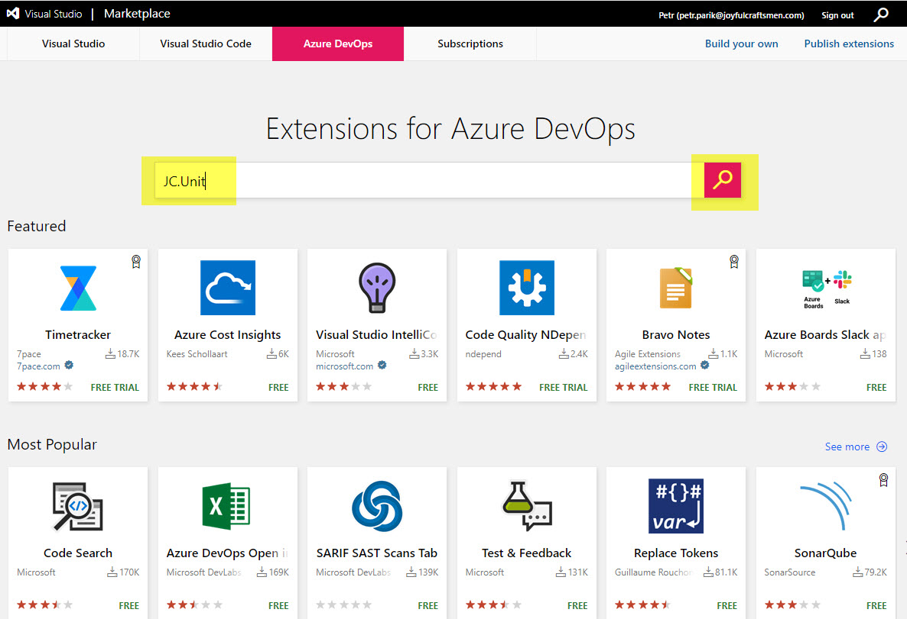
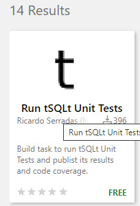

# Get JC.Unit Extension for Azure DevOps

In order to install the extension, you'll need to be an admin of your Azure DevOps services organization. In case you are not, still follow this guideline - you can at least generate a request for your admin.

First, navigate to Marketplace page: [https://marketplace.visualstudio.com/azuredevops](https://marketplace.visualstudio.com/azuredevops).

Type "JC.Unit" and click the search button:

Click on the found extension: (replace with correct screenshot)

Click on "Get

## If you ARE admin

## If you are NOT admin

