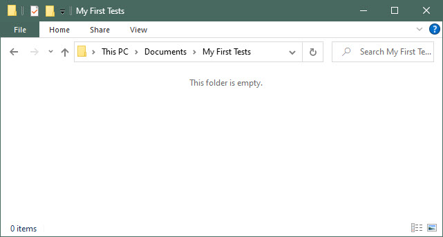
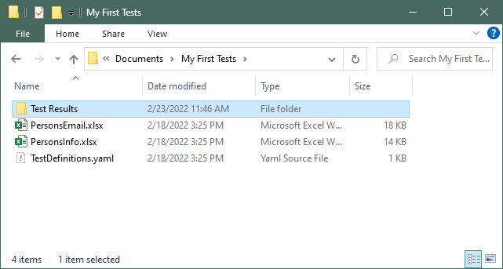
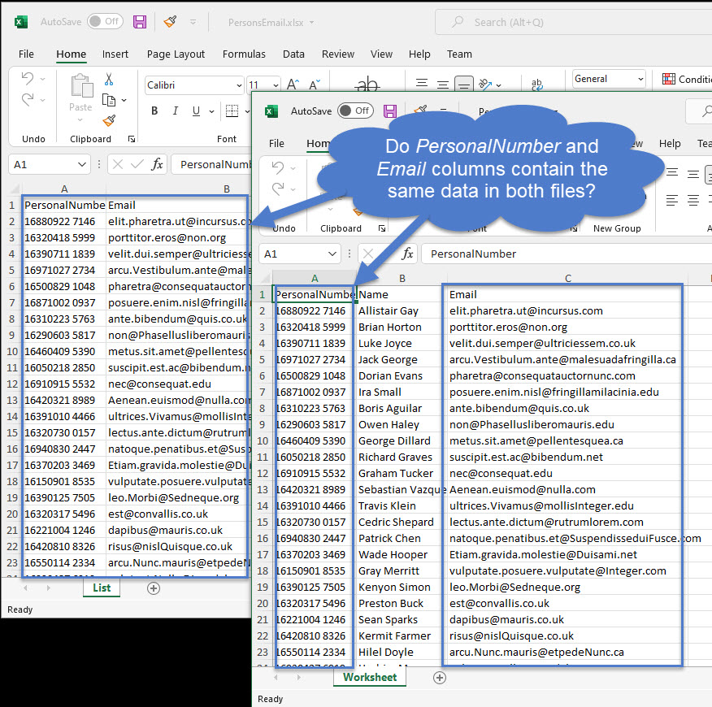
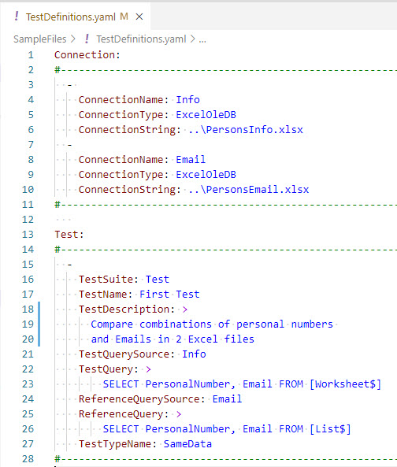

# Create your first test

In this chapter, we'll guide you step by step how to create your first simple test.
You'll learn how to create a connection to your data, how to write a test and how to run it. 

Because this lesson is an introduction to using JC.Unit, it does not use or
describe many of the options available for this tool.

## Prepare a folder for your test

Create a folder anywhere on your local drive. You will store your test artifacts and results there.

Now, download two samle files that we prepared for your first test: <a href="SampleFiles/PersonsEmail.xlsx" download>PersonsEmail.xlsx</a> and <a href="SampleFiles/PersonsInfo.xlsx" download>PersonsInfo.xlsx</a>. Place them to the folder you just created. 

> Don't worry, you'll be able to compare anything with anything (e.g. SQL server table with an MS Excel file, ORACLE table with result of DAX query, ...). We'll be comparing two MS Excel sheet in our first test.

Create a subfolder for storing the results of the tests - name it "Test Results".

Last thing you need in the folder is a file with definition of your connections and tests. We prepared it for you: <a href="SampleFiles/TestDefinitions.yaml" download>TestDefinitions.yaml</a>. We'll examine it very soon, be patient.

> Again, don't worry, you'll NOT be forced to store the connections and tests defintions in a YAML file. We chose that option for intro test because it is super easy. You'll have options to store your files in MS Excel files, SQL Server, ORACLE, YAML, ...

Now, your folder should look something like this:

## What will we test

We have two sample MS Excel files. We want to compare two specified columns and check, whether the data are the same in both files:

For this to happen, we need to define somewhere two *connections* (one to PersonsEmail.xlsx and one to PersonsInfo.xlsx) and one *test* (that compares the data in the columns of choice).

Now, examine the content of TestDefinitions.yaml file:

Please note how easy it is to add more connections and more tests. The file in this format is easy to read and easy to maintain (but you will be not forced to use YAML format, there's lot of other options where to define connections and tests).

## Run the test

OK, all is set up, we can run the test and see, whether the columns contain the same data or not.

You have more options, how to run the tests:

* from PowerShell
* using GUI, "JC.Unit Runner"
* in Azure DevOps pipeline

Let's use PowerShell first. You need PowerShell 5 or newer. Run these commands:

~~~~~~~~~~~~~~~~~~~~~~~~~~~~~~~~~~~~~~~~~~~~~~~~~~~~~~~~~~~~
Import-Module JC.Unit

Invoke-JcUnitTest `
	-ConnectionDefinitionsProvider Yaml `
	-ConnectionDefinitionsSettings .\TestDefinitions.yaml `
	-TestDefinitionsProvider Yaml `
	-TestDefinitionsSettings .\TestDefinitions.yaml `
	-LogFilesFolder '.\Test Results\' `
	-WorkingDirectory .
~~~~~~~~~~~~~~~~~~~~~~~~~~~~~~~~~~~~~~~~~~~~~~~~~~~~~~~~~~~~

What we say here is, that our connections and tests are defined in a YAML file, where the file is, where we want to store test results and working directory. (Working directory is a path against which all relative paths are resolved.)

TODO: this throws error. I'm not admin, the PS module is trying to create JC.Unit.json file under C:\Program Files\WindowsPowerShell\Modules\JC.Unit folder.

TODO: screenshots of results in console window, screenshots of result files

All of this is automation friendly, but there is also GUI for running the tests, JC.Unit Runner. You can start when you run this from PowerShell window:

~~~~~~~~~~~~~~~~~~~~~~~~~~~~~~~~~~~~~~~~~~~~~~~~~~~~~~~~~~~~
Show-JcUnitGUI
~~~~~~~~~~~~~~~~~~~~~~~~~~~~~~~~~~~~~~~~~~~~~~~~~~~~~~~~~~~~

You can also specify the working folder directly (dot for current folder):

~~~~~~~~~~~~~~~~~~~~~~~~~~~~~~~~~~~~~~~~~~~~~~~~~~~~~~~~~~~~
Show-JcUnitGUI -WorkingFolder .
~~~~~~~~~~~~~~~~~~~~~~~~~~~~~~~~~~~~~~~~~~~~~~~~~~~~~~~~~~~~

TODO: bude runner mít switch pro working folder? Nebo budeme chtít vybrat dll? Jestli bude runner v PowerShellu, může být problém s právama, viz výše.

TODO: ukázat, jak spustit testy v JC.Runneru.

[Previous chapter](get-jc-unit)  --- [Next chapter](../quick-start-devops/install-jc-unit-extension) 

[Back to the List of Contents](../index)  