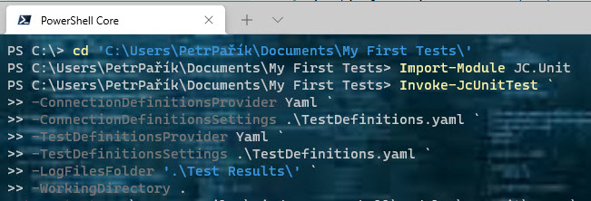

# Run First Test

OK, all is set up, we can run the test we just created. We want to know, whether the columns contain the same data or not, right?

You have more options, how to run the tests:

* from PowerShell
* using GUI, "JC.Unit Runner"
* in Azure DevOps pipeline

## Run the Test Using JC.Unit Runner

The simplest way to run the tests and explore results is to use a GUI - JC.Unit Runner. You can start when you run this from PowerShell window:

~~~~~~~~~~~~~~~~~~~~~~~~~~~~~~~~~~~~~~~~~~~~~~~~~~~~~~~~~~~~
Show-JcUnitGUI
~~~~~~~~~~~~~~~~~~~~~~~~~~~~~~~~~~~~~~~~~~~~~~~~~~~~~~~~~~~~

opravdu takto? nebo z nabídky Start? Když ze start, jak se tam dostane, když JC.Unit bereme z PowerShell Gallery?

bude runner mít switch pro working folder? Nebo budeme chtít vybrat dll? Jestli bude runner v PowerShellu, může být problém s právama, viz výše.

ukázat, jak spustit testy v JC.Runneru, ukázat výsledky.

## Run the Test Using PowerShell

The GUI is handy and you'll use it offten to check the restuls of your tests. But what about automation? Let's use PowerShell now. You need PowerShell 5 or newer. Run these commands:

~~~~~~~~~~~~~~~~~~~~~~~~~~~~~~~~~~~~~~~~~~~~~~~~~~~~~~~~~~~~
Import-Module JC.Unit

Invoke-JcUnitTest `
	-ConnectionDefinitionsProvider Yaml `
	-ConnectionDefinitionsSettings .\TestDefinitions.yaml `
	-TestDefinitionsProvider Yaml `
	-TestDefinitionsSettings .\TestDefinitions.yaml `
	-LogFilesFolder '.\Test Results\' `
	-WorkingDirectory .
~~~~~~~~~~~~~~~~~~~~~~~~~~~~~~~~~~~~~~~~~~~~~~~~~~~~~~~~~~~~

What we say here is, that 

* our connections and tests are defined in a YAML file
* where that file is
* where we want to store test results 
* and working directory. 

Working directory is a path against which *all* relative paths are resolved.

this throws error. I'm not admin, the PS module is trying to create JC.Unit.json file under C:\Program Files\WindowsPowerShell\Modules\JC.Unit folder.

screenshots of results in console window, screenshots of result files

------

[Previous chapter](./create-first-test)  --- [Next chapter](../quick-start-devops/intro)

[Back to the List of Contents](../index)  

