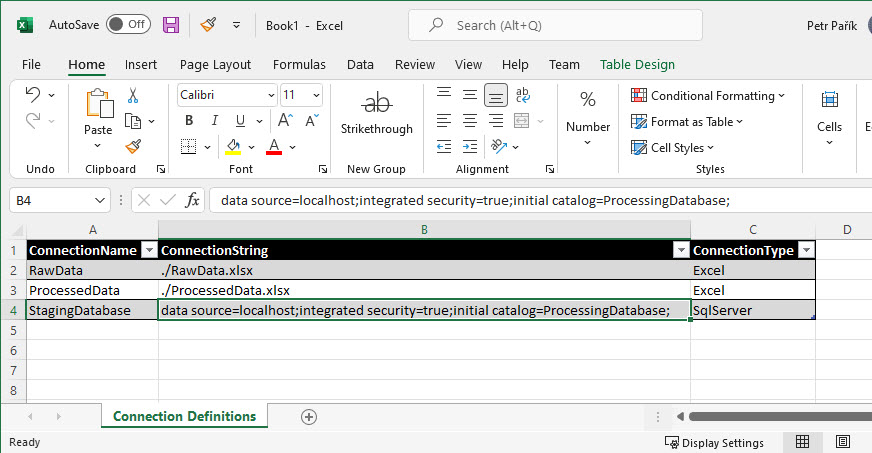

# MS Excel OleDB Connection Definition Provider

> **Important:** Generally, newer [Excel Connection Definition Provider](./ms-excel) is recommended.

This [Connection Definition Provider](../connection-definition-providers) needs "Microsoft Access Database Engine 2016 Redistributable", see [prerequisites](../../installation/prerequisites).

Using this provider, you can load [Connection Definitions](../what-is-connection-definition) from a MS Excel file:

The name of the sheet must be "Connection Definitions" (mind the space). This is not configurable.

Names of the columns must be ConnectionName, ConnectionString, ConnectionType. All of them are mandatory. See details of each *Connection Type* to be sure you fill in correct values in ConnectionString column.

You can have more columns (e.g.,  Notes as column D). Additional columns are ignored by the JC.Unit framework.

## Permissions

The account JC.Unit runs under must have read permissions on the MS Excel file.
