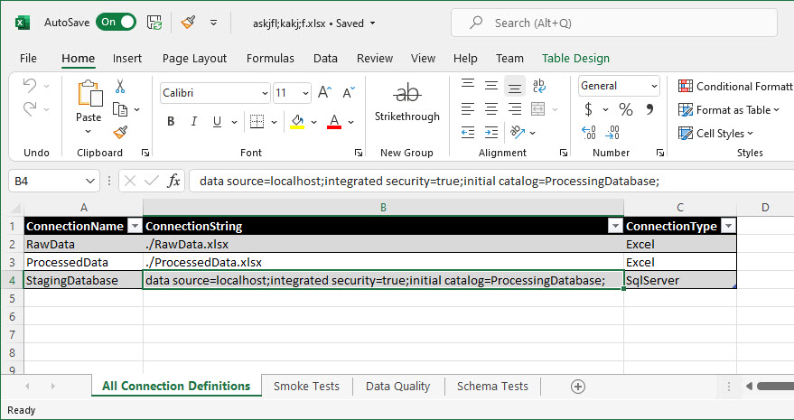

# MS Excel Connection Definition Provider

Using this [provider](../connection-definition-providers), you can load [Connection Definitions](../what-is-connection-definition) from a MS Excel file:

The name of a worksheet does not matter. The provider goes through all worksheets. If a worksheet contains a column with header "ConnectionName", it considers it as a list of [Connection Definitions](../what-is-connection-definition).

This has two important advantages:

* First, you can (but you don't have to) define connections on more sheets (e.g. connections to MS Excel on one sheet, connection to databases on another). But you can of course keep all of them on one sheet, up to you.

* Second, you can store both your [Connection Definitions](../what-is-connection-definition) and [Test Definitions](../../test-definitions/what-is-test-definition) in the very same MS Excel workbook (scanning for Test Definitions works the same way).

Names of the columns must be ConnectionName, ConnectionString, ConnectionType. All of them are mandatory. See details of each *Connection Type* to be sure you fill in correct values in ConnectionString column.

You can have more columns (e.g.,  Notes as column D). Additional columns are ignored by the JC.Unit framework.

The provider intentionally skips all rows, where at least one cell is formatted with strike-through.

This provider does not have any dependencies and works out-of-the-box (compared to [Excel OleDB Connection Definition Provider](./ms-excel-oledb), which requires installation of a driver).

## Permissions

The account JC.Unit runs under must have read permissions on the MS Excel file.
