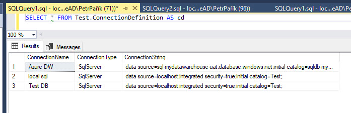

# MS SQL Server Connection Definition Provider

With MS SQL Server Connection Definition Provider, you can load connection definitions from a table in a MS SQL server database.

The table must be in a schema "Test" and must be named "ConnectionDefinition". This is not configurable in this version of JC.Unit. The query for retrieving the connection definitions is hardcoded in the system like this: 

~~~~~~~~~~~~~~~~~~~~~~~~~~~~~~~~~~~~~~~~~~~~
SELECT * FROM Test.ConnectionDefinition
~~~~~~~~~~~~~~~~~~~~~~~~~~~~~~~~~~~~~~~~~~~~

The table has to contain columns ConnectionName, ConnectionString and ConnectionType. All of them must be of any string data type (varchar, nvarchar recommended). The table can have additional columns - these are ignored by the system.

Using this script, you can initialize your MS SQL Server database, so that it can hold both *Connection Definitions* and *Test Definitions*.

> ! Important: You can store *Connection Definitions* and *Test Definitions* separately, using different provider. This scenario is fully supported. We use it offten in our testing projects. If this is relevant for you, feel free to adjust the script below and create only what you need.

~~~~~~~~~~~~~~~~~~~~~~~~~~~~~~~~~~~~~~~~~~~~~~~~~~~~~~~~~~~~~~~~~~~~~~~~~~~~~~~~~~~~~~~~
GO
-- create schema Test
IF SCHEMA_ID('Test') IS NULL
BEGIN
	EXEC sys.sp_executesql @stmt =  N'CREATE SCHEMA [Test] AUTHORIZATION [dbo];'
END
GO
-- create table for connection definitions
IF (OBJECT_ID(N'[Test].[ConnectionDefinition]', 'U') IS NULL)
BEGIN
	CREATE TABLE [Test].[ConnectionDefinition]
	(
		[ConnectionName] [NVARCHAR](200) NOT NULL PRIMARY KEY CLUSTERED,
		[ConnectionType] [NVARCHAR](200) NOT NULL,
		[ConnectionString] [NVARCHAR](2000) NOT NULL
	);
END;
GO
-- create table for test definitions
IF (OBJECT_ID(N'[Test].[TestDefinition]', 'U') IS NULL)
BEGIN
	CREATE TABLE [Test].[TestDefinition]
	(
		[TestSuite] NVARCHAR(300) NULL,
		[Order] INT NULL,
		[TestCase] NVARCHAR(300) NULL,
		[TestName] NVARCHAR(300) NOT NULL,
		[TestDescription] NVARCHAR(MAX) NULL,
		[TestQuerySource] NVARCHAR(200) NULL,
		[TestQuery] NVARCHAR(MAX) NULL,
		[ReferenceQuerySource] NVARCHAR(200) NULL,
		[ReferenceQuery] NVARCHAR(MAX) NULL,
		[TestTypeName] VARCHAR(50) NOT NULL,
		[Tolerance] DECIMAL(19, 4) NULL,
		[Timeout] INT NULL
	);
END;
GO
-- Add foreign keys
IF NOT EXISTS ( SELECT * FROM sys.foreign_keys AS fk WHERE fk.name = N'FK_TestDefinition_ConnectionDefinition_Test')
BEGIN
	ALTER TABLE Test.TestDefinition ADD CONSTRAINT FK_TestDefinition_ConnectionDefinition_Test FOREIGN KEY (TestQuerySource) REFERENCES Test.ConnectionDefinition(ConnectionName);
END
IF NOT EXISTS ( SELECT * FROM sys.foreign_keys AS fk WHERE fk.name = N'FK_TestDefinition_ConnectionDefinition_Reference ')
BEGIN
	ALTER TABLE Test.TestDefinition ADD CONSTRAINT FK_TestDefinition_ConnectionDefinition_Reference FOREIGN KEY (ReferenceQuerySource) REFERENCES Test.ConnectionDefinition(ConnectionName);
END;
GO
~~~~~~~~~~~~~~~~~~~~~~~~~~~~~~~~~~~~~~~~~~~~~~~~~~~~~~~~~~~~~~~~~~~~~~~~~~~~~~~~~~~~~~~~

## Permissions

The account JC.Unit runs under must have read permissions on the [Test].[ConnectionDefinition] table.
