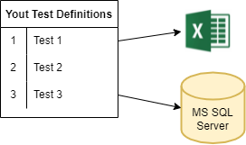

# What is Connection Definition

JC.Unit is a framework focused on testing data. Therefore, it is expected that when you are defining your tests, you certainly want them to connect to data. 

Let's have a simple example:

You have tens of tests, but all of them connect to only two sources of data: one is MS Excel file somewhere on your file system, the other are tables in a MS SQL server database on some server. Tens of tests, only two sources.

When you define your tests (on the picture on the left), you *don't* specify all connection details to data sources on each row.

> The *Test Definitions* and *Connection Definitions* are defined separately, in two distinct lists. In *Test Definitions* you refer to *Connection Definitions* by name.

This means, in our example:

* you give a name to the Excel file connection definition, e.g. MyExcel
* you give a name to the SQL Server database you work with, e.g. MyDatabase
* in the test definitions, you refer to these sources using those two names.

The same way you define test, you also define these connections. 

Example of data, that make up a Connection Definition:

| Key              | Value         |
| ---------------- | ------------- |
| ConnectionName   | MyExcelData   |
| ConnectionType   | ExcelOleDB    |
| ConnectionString | .\MyData.xlsx |

 

--------------------------

## Related Topics:

* You need to define the Connection Definitions somewhere (in local file or in a database) - see [Connection Definition Providers](./connection-definition-providers). The article also enumerates supported ConnectionTypes that are supported.

* The connections you define can be then used in [Test Definitions](../test-definitions/what-is-test-definition).

