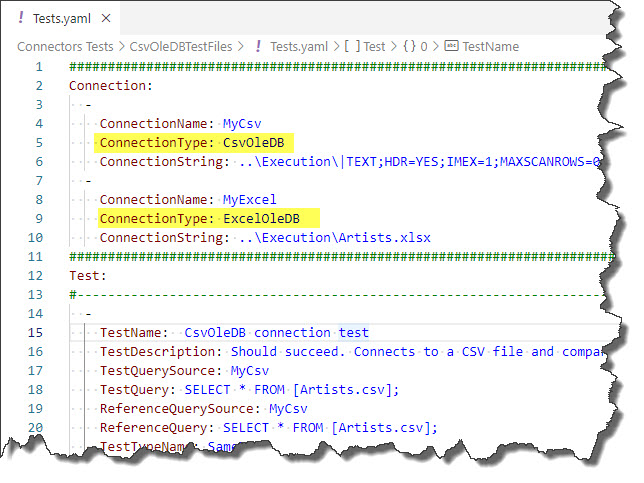

# Connectors

JC.Unit supports a few sources where you can store your Connection Definitions and Test Definitions. But regarding *testing* of data, lot's of data sources are supported:

| Connector Name | Code |
| -------------- | ---- |
| [CSV OleDB](./csvoledb)           | CsvOleDB |
| [Analytical Models (DAX)](./dax)          | Dax |
| [MS Excel OleDB](./excel-oledb)           | Excel |
| [MS Excel](./excel)           | ExcelOleDB |
| [ORACLE](./oracle)            | Oracle |
| [Power BI Desktop Models](./pbix)         | Pbix |
| [PostgreSQL](./postgres)          | Postgres |
| [MS SQL Server](./sqlserver)          | SqlServer |

Just provide a Code from the above table in the ConnectionType filed, when you are definition your connections. E.g., in YAML, it might look like this:

Similarly, for other [Connection Definition Providers](../connection-definitions/connection-definition-providers), you specify any of the above Code values in ConnectionType column.

In the above example, you tell to JC.Unit to connect to data sources using CsvOleDB provider and ExcelOleDB provider.

The examples for all connectors use YAML in examples. The same fields/properties/columns are expected for other [Connection Definition Providers](../connection-definitions/connection-definition-providers). Just use fields/properties/columns with the same name as in YAML examples.