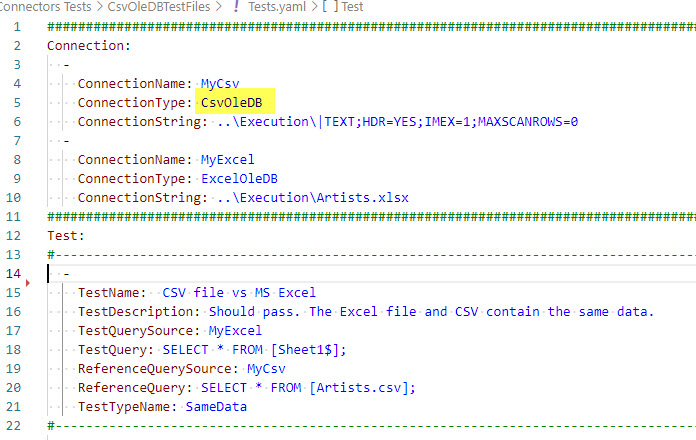

# CsvOleDB Connector

## Prerequisites

To use this connector, you need to install "Microsoft Access Database Engine 2016 Redistributable" driver. See [prerequisites](../installation/prerequisites).

## Description
This provider allows you to connect to CSV files and issue SQL statements against it's data.

> CsvOleDB connector allows basic SQL operations, such as filtering, grouping or sorting. That means you don't need to compare raw CSV data, you can test a result of SQL query issued against the CSV data.

In the connector's connection string, you specify the *folder* where your CSV data are, not the full path to the file. This is not intuitive, but it is handy, as you can define one connection for many CSV files in the same folder.

## Example

In the first Connection Definition, you instruct JC.Unit to connect to Execution folder one level above working directory. 

> **Important** Please mention you do NOT specify the file name in the connection string. The path should point to the folder where your CSV file resides. 

~~~~~~~~~~~~~~~~~~~~~~~~~~~~~~~~~~~~~~~~~~~~~~~~~~~~~~~~~~~~~~~~~~~~~~~~~~~
Connection:
  - 
    ConnectionName: MyCsv
    ConnectionType: CsvOleDB
    ConnectionString: ..\Execution\|TEXT;HDR=YES;IMEX=1;MAXSCANROWS=0
~~~~~~~~~~~~~~~~~~~~~~~~~~~~~~~~~~~~~~~~~~~~~~~~~~~~~~~~~~~~~~~~~~~~~~~~~~~

The example above tells to JC.Unit to use CSV files in Execution folder one level above your working folder. Just replace "..\Execution\" with path to folder with your CSV data. The path can be either absolute or relative to your working directory. 

You can also tweak whether your file has headers or not, just use HDR=YES or HDR=NO.

In the query you need to specify in FROM clause the name of the CSV file. See ReferenceQuery in the above example. It instructs JC.Unit to read all columns and all rows from the Artists.csv file that is located in the folder mentioned in the ConnectionString.

This also means you can define just one connection for all CSV files in the same folder.

The example above then uses SameData test type to compare data in the CSV file with the data in the MS Excel file.

