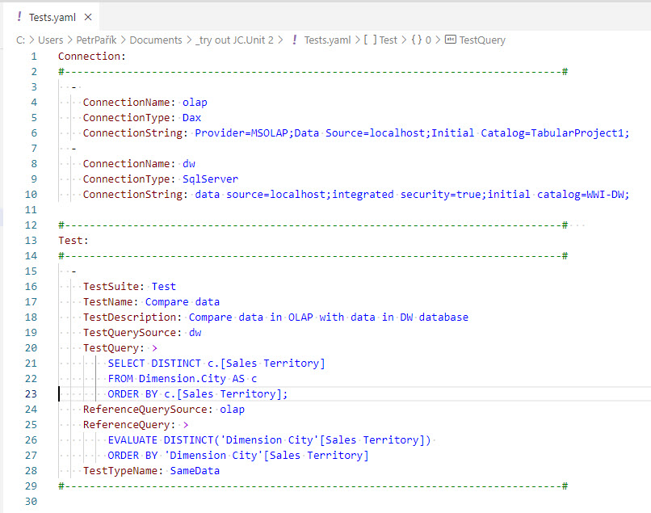

# DAX Connector

## Prerequisites

To use this connector, you need to install "Microsoft Access Database Engine 2016 Redistributable" driver. See [prerequisites](../installation/prerequisites).

## Description
This connector allows you to test data in analytical models, such as Microsoft SQL Server Analysis Services, MS Azure Analysis Services or Power BI Premium capacity datasets.

## Example
Use "Dax" ConnectorType in the Connection Definition:

The example above compares data in a dimension table in Data Warehouse SQL Server database with dimension table in a tabular model of local instance of SQL Server Analyses serivces.

Notice how easy it is to compare a result of a DAX query with a result of SQL Server database engine query using JC.Unit.

Change server name (if it is not localhost) and database name in the connection string:

~~~~~~~~~~~~~~~~~~~~~~~~~~~~~~~~~~~~~~~~~~~~~~~~~~~~~~~~~~~~~~~~~~~~~~~~~~~~~~~~
Connection:
  - 
    ConnectionName: olap
    ConnectionType: Dax
    ConnectionString: Provider=MSOLAP;Data Source=localhost;Initial Catalog=TabularProject1;
~~~~~~~~~~~~~~~~~~~~~~~~~~~~~~~~~~~~~~~~~~~~~~~~~~~~~~~~~~~~~~~~~~~~~~~~~~~~~~~~
