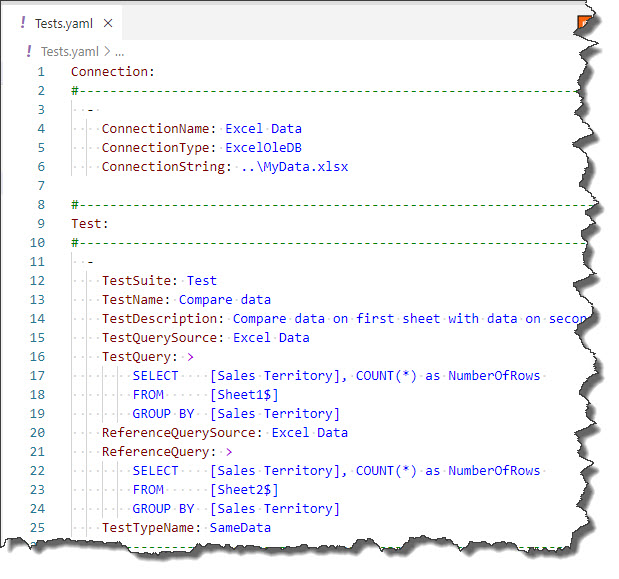

# ExcelOleDB Connector

## Prerequisites

To use this connector, you need to install "Microsoft Access Database Engine 2016 Redistributable" driver. See [prerequisites](../installation/prerequisites).

## Description
Using Excel OleDB Connector, you can connect to data in MS Excel .xlsx files. You can even use basic SQL against those data, such as filtering, grouping and sorting.

## Example

In the example above it is specified, that JC.Unit should connect to MyData.xlsx file one level above your working directory, using ExcelOleDB connector.

The test then compares data on the first sheet with data on the second sheet (the queries differ only in FROM clause). Notice the test does not compare raw data in the seeths, rather it compares results of SQL queries issued against those sheets.

~~~~~~~~~~~~~~~~~~~~~~~~~~~~~~~~~~~~~~~~~~~~~~~~~~~~~~~~~~~~~~~~~~~~~~~~~~~~~~~~
Connection:
  - 
    ConnectionName: Excel Data
    ConnectionType: ExcelOleDB
    ConnectionString: ..\MyData.xlsx
~~~~~~~~~~~~~~~~~~~~~~~~~~~~~~~~~~~~~~~~~~~~~~~~~~~~~~~~~~~~~~~~~~~~~~~~~~~~~~~~

