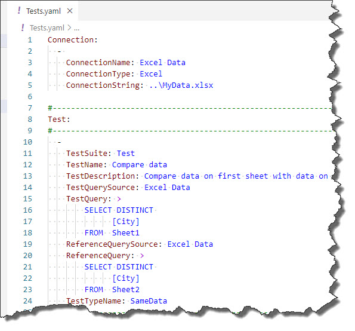

# Excel Connector

## Prerequisites

This connector has no prerequisites, it works out-of-the-box. Just use it :-).

## Description

This connector allows you to compare data in MS Excel .xlsx files. However, ExcelOleDB Connector might be better for your tests in many cases. Excel connector has some advantages and some disadvantages over ExcelOleDB connector:

Advantages:

* Excel connector requires no drivers. It works out-of-the-box. This might be important e.g., in the context of Azure DevOps hosted agent.

* Excel connector has a feature of skipping rows that are formatted with strike-through. If it is of any help for you, use Excel connector.

Disadvantages:

* Excel connector is much less performant than ExcelOleDB connector. If you are working with large files, use ExcelOleDB.

* Excel connector supports only very basic SQL.  Only SELECT, FROM and WHERE are recognized. 

Filtering in WHERE clause uses syntax described in these articles:

* [https://docs.microsoft.com/en-us/dotnet/api/system.data.datatable.select?view=net-6.0#system-data-datatable-select(system-string)](https://docs.microsoft.com/en-us/dotnet/api/system.data.datatable.select?view=net-6.0#system-data-datatable-select(system-string))

* [https://www.csharp-examples.net/dataview-rowfilter/](https://www.csharp-examples.net/dataview-rowfilter/)

> **IMPORTANT**: Although you can use the syntax mentioned above, this is unsupported. Whenever you need to issue SQL queries against Excel data, use [ExcelOleDB Connector](./excel-oledb). Anything beyond simle `SELECT * FROM SheetName` is unsupported.

## Example

In this example, the test will compare values in column City on Sheet1 and Sheet2 using Excel connector:

~~~~~~~~~~~~~~~~~~~~~~~~~~~~~~~~~~~~~~~~~~~~~~~~~~~~~~~~~~~~~~~~~~~~~~~
Connection:
  - 
    ConnectionName: Excel Data
    ConnectionType: Excel
    ConnectionString: ..\MyData.xlsx
~~~~~~~~~~~~~~~~~~~~~~~~~~~~~~~~~~~~~~~~~~~~~~~~~~~~~~~~~~~~~~~~~~~~~~~