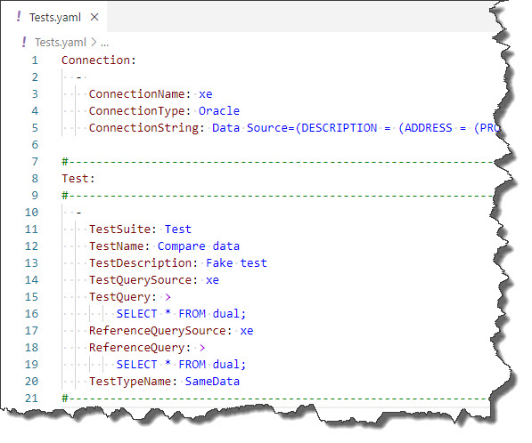

# ORACLE Connector

## Prerequisites

This connector has no prerequisites, it works out-of-the-box. Just use it :-).

## Description

This connector allows you to test data in ORACLE database tables. You can specify any SQL statement suppoerted by [Oracle.ManagedDataAccess.Core](https://www.nuget.org/packages/Oracle.ManagedDataAccess.Core/3.21.50) .NET NugetPackage.

## Example

The test defined above only compares the same table issued against ORACLE express edition.

~~~~~~~~~~~~~~~~~~~~~~~~~~~~~~~~~~~~~~~~~~~~~~~~~~~~~~~~~~~~~~~~~~~~~~~~~~~~~~~
Connection:
  - 
    ConnectionName: xe
    ConnectionType: Oracle
    ConnectionString: Data Source=(DESCRIPTION = (ADDRESS = (PROTOCOL = TCP)(HOST = LOCALHOST)(PORT = 1521)) (CONNECT_DATA = (SERVER = DEDICATED) (SERVICE_NAME = xe)));User Id=System;Password=Pa$$w0rd;Persist Security Info=True;
~~~~~~~~~~~~~~~~~~~~~~~~~~~~~~~~~~~~~~~~~~~~~~~~~~~~~~~~~~~~~~~~~~~~~~~~~~~~~~~
