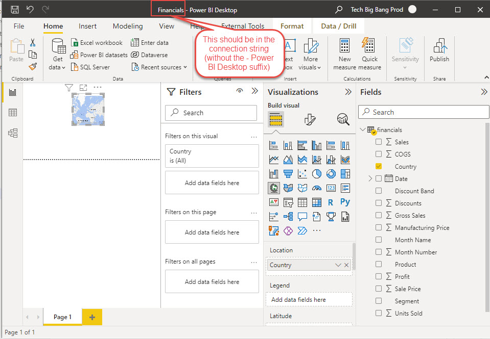
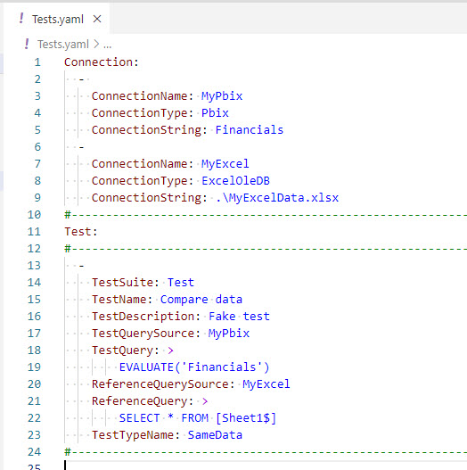

# PBIX Connector

## Prerequisites

This connector requires [Power BI Desktop](https://powerbi.microsoft.com/en-us/desktop/) to be installed on your machine.

## Description

This connector connects to a local PBIX file and runs DAX queries against it.

> **Important:** The file must be already open when you run queries against it. 

The connector is designed for *local* testing, not for automated testing in a Azure DevOps pipeline.

The ConnectionString must contain a title of a running Power BI desktop window. If you have troubles and JC.Unit does not see the file, please be sure you are not in "Transform Data" window.

## Example

In the above example, data from 'Financials' table from open PBIX file is compared with data from MS Excel file.

~~~~~~~~~~~~~~~~~~~~~~~~~~~~~~~~~~~~~~~~~~~~~~~~~~~~~~~~~~~~~~~~~~~~~~~~~~~~~
Connection:
  - 
    ConnectionName: MyPbix
    ConnectionType: Pbix
    ConnectionString: Financials
~~~~~~~~~~~~~~~~~~~~~~~~~~~~~~~~~~~~~~~~~~~~~~~~~~~~~~~~~~~~~~~~~~~~~~~~~~~~~    