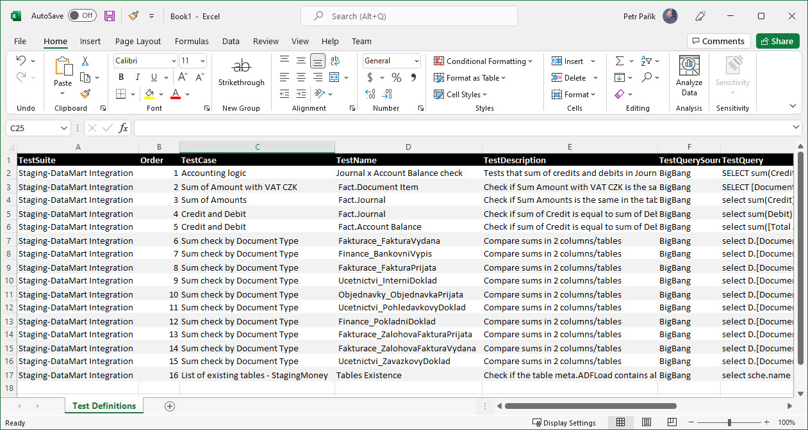

# MS Excel OleDB Test Definition Provider

> **Important:** Newer [Excel Test Definition Provider](./ms-excel) is recommended.

This [Test Definition Provider](../test-definition-providers) needs "Microsoft Access Database Engine 2016 Redistributable", see [prerequisites](../../installation/prerequisites).

Using this provider, you can load [Test Definitions](../what-is-test-definition) from a MS Excel file:

The name of the sheet must be "Test Definitions" (mind the space). This is not configurable.

Names of the columns must match the names specified in this article: [Test Definition](../what-is-test-definition). At least all the mandatory columns must be included in the worksheet you are loading from. See details of each *Test Type* to be sure you have all necessary columns. The easiest way to get started is to just include all the columns.

You can also have additional columns (e.g.,  Notes). Additional columns are ignored by the JC.Unit framework.

## Permissions

The account JC.Unit runs under must have read permissions on the MS Excel file.
