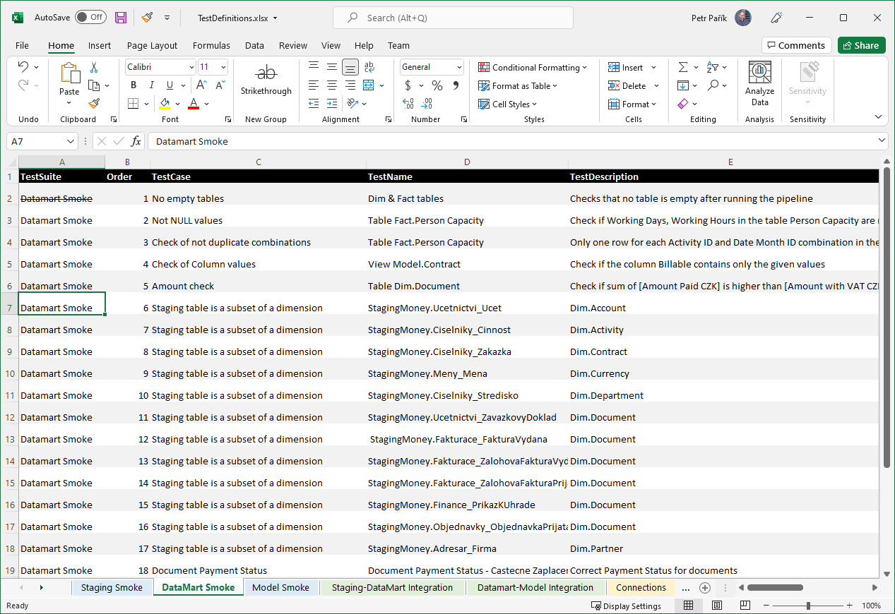

# MS Excel Test Definition Provider

Using this [provider](../test-definition-providers), you can load [Test Definitions](../what-is-test-definition) from a MS Excel file:

The name of a worksheet does not matter. The provider goes through all worksheets. If a worksheet contains a column with header "TestName", it considers it as a list of [Test Definitions](../what-is-test-definition).

This has two important advantages:

* First, you can (but you don't have to) define tests on more sheets. See the example on the picture - you can split all your tests into different Worksheets. 

* Second, you can store both your [Connection Definitions](../what-is-connection-definition) and [Test Definitions](../../test-definitions/what-is-test-definition) in the very same MS Excel workbook (scanning for Connection Definitions works the same way).

Names of the columns must match the names specified in this article: [Test Definition](../what-is-test-definition). At least all the mandatory columns must be included in the worksheet you are loading from. See details of each *Test Type* to be sure you have all necessary columns. The easiest way to get started is to just include all the columns.

You can also have additional columns (e.g.,  Notes). Additional columns are ignored by the JC.Unit framework.

The provider intentionally skips all rows, where at least one cell is formatted with strike-through. In the example on the picture above, the row with Order 1 (No Empty tables, Dim & Fact tables) will be ignored.

This provider does not have any dependencies and works out-of-the-box (compared to [Excel OleDB Test Definition Provider](./ms-excel-oledb), which requires installation of a driver).

## Permissions

The account JC.Unit runs under must have read permissions on the MS Excel file.
