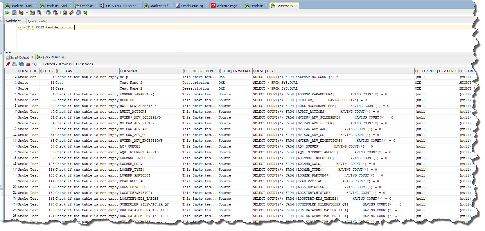

# ORACLE Test Definition Provider

With ORACLE [Connection Definition Provider](../connection-definition-providers), you can load connection definitions from a table in your ORACLE database.

The table must be named "TESTDEFINITION". This is not configurable in this version of JC.Unit. The query for retrieving the test definitions is hardcoded in the system like this: 

~~~~~~~~~~~~~~~~~~~~~~~~~~~~~~~~~~~~~~~~~~~~
SELECT * FROM TestDefinition;
~~~~~~~~~~~~~~~~~~~~~~~~~~~~~~~~~~~~~~~~~~~~

The table has to contain columns specified in this article: [Test Definition](../what-is-test-definition). At least all the mandatory columns must be present in the table. The easiest way is to use the script below to create the table. It contains all columns JC.Unit knows about. Insert NULL in columns you don't use.

Using this script, you can initialize your ORACLE database, so that it can hold both *Connection Definitions* and *Test Definitions*.

> ! Important: You can store *Connection Definitions* and *Test Definitions* separately, using different provider. This scenario is fully supported. We use it offten in our testing projects. If this is relevant for you, feel free to adjust the script below and create only what you need.

~~~~~~~~~~~~~~~~~~~~~~~~~~~~~~~~~~~~~~~~~~~~~~~~~~~~~~~~~~~~~~~~~~~~~~~~~~~~~~~~~~~~~~~~~~~~~~~~~~~~~~~~~~~~~~~~~~
--------------------------------------------------------
--  DDL for Table CONNECTIONDEFINITION
--------------------------------------------------------

  CREATE TABLE "CONNECTIONDEFINITION" 
   (	
    "CONNECTIONNAME" VARCHAR2(200 BYTE), 
	"CONNECTIONTYPE" VARCHAR2(200 BYTE), 
	"CONNECTIONSTRING" CLOB
   ) ;
   
   
--------------------------------------------------------
--  DDL for Table TESTDEFINITION
--------------------------------------------------------

  CREATE TABLE "TESTDEFINITION" 
   (	
    "TESTSUITE" VARCHAR2(300 BYTE), 
	"ORDER" NUMBER(*,0), 
	"TESTCASE" VARCHAR2(300 BYTE), 
	"TESTNAME" VARCHAR2(300 BYTE), 
	"TESTDESCRIPTION" VARCHAR2(4000 BYTE), 
	"TESTQUERYSOURCE" VARCHAR2(200 BYTE), 
	"TESTQUERY" VARCHAR2(4000 BYTE), 
	"REFERENCEQUERYSOURCE" VARCHAR2(200 BYTE), 
	"REFERENCEQUERY" VARCHAR2(4000 BYTE), 
	"TESTTYPENAME" VARCHAR2(50 BYTE), 
	"CATEGORIES" VARCHAR2(300 BYTE), 
	"TOLERANCE" NUMBER(19,4), 
	"TIMEOUT" NUMBER(*,0)
   ) ;
   
   
-- example rows, feel free to skip these
INSERT INTO CONNECTIONDEFINITION values ('OXE','Oracle','Data Source=(DESCRIPTION = (ADDRESS = (PROTOCOL = TCP)(HOST = LOCALHOST)(PORT = 1521)) (CONNECT_DATA = (SERVER = DEDICATED) (SERVICE_NAME = xe)));User Id=System;Password=;Persist Security Info=True;');

INSERT INTO TESTDEFINITION values ('Suite',11,'Case','Test Name 2', 'Deeescription', 'OXE', 'SELECT * FROM SYS.DUAL', 'OXE', 'SELECT * FROM SYS.DUAL','SameData','Categorieees',NULL, NULL );

COMMIT;
   
~~~~~~~~~~~~~~~~~~~~~~~~~~~~~~~~~~~~~~~~~~~~~~~~~~~~~~~~~~~~~~~~~~~~~~~~~~~~~~~~~~~~~~~~~~~~~~~~~~~~~~~~~~~~~~~~~~

## Permissions

The account JC.Unit runs under must have read permissions on the TESTDEFINITION table.
