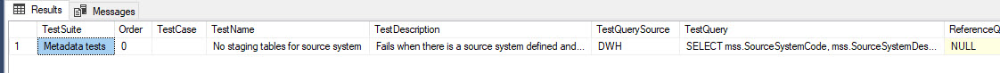

# YAML Test Definition Provider

When using YAML [Test Definition Provider](../test-definition-providers), you store your test definitiions in a YAML file:

The [Test Definitions](../what-is-test-definition) are defined on row 12 and below in the above example. 

Names of the keys must match the names specified in this article: [Test Definition](../what-is-test-definition). At least all the mandatory keys must be included in each test definition. See details of each *Test Type* to be sure you have all necessary keys. Mandatory keys vary between tests, because different *Test Types* have different requirements for mandatory keys.

You can also have additional keys (e.g.,  Notes). Additional keys are ignored by the JC.Unit framework.

Notice you can (but you don't have to) store both your Connection Definitions and Test Definitions in the very same file. This is very convenient for development of tests.

## Why We Recommend YAML Test Definition Provider: SQL Queries

> **Important note:** YAML Test definition provider is the coolest among all the others because it is by far the most convenient format for editing more complex SQL statements.

It is very common when you define tests for your data, that you use both simple and relatively complex SQL queries. The more complex the query is, the more inconvenient it is to handle it in other formats. You have to escape characters, the viewing and editing is cumbersome. Imagine a simpele test, that is checking there is at least one staging table in the data warehouse for each source system defined in metadata. Compare what it looks like in MS Excel, SQL server and YAML:

### MS Excel: painful to review, cumbersome to edit

### SQL Server: almost imposible to review in SSMS, edit only with UPDATE command, quotes need to be escaped

### YAML: easy on eyes, easy to edit

Notice the sign ">" on the picture. It is intentionally highlighted. TODO: describe why.

## When You Should NOT Use YAML Test Definition Provider:

We recommend to use YAML for storing both Connection Definitions and Test Definitions, unless you have good reason to use others. We use other providers especially in these situations:

* [MS Excel Provider](./ms-excel.md) when business users want to provide tests for the data. Business people usually know basics of SQL and have good know-how about the data. But YAML format might be scary for them, they are more used to MS Excel.

* [SQL Server Provider](./sql-server) or [ORACLE Provider](./oracle) because these allow us much more easily auto-generate tests based on metadata.

## Permissions

The account JC.Unit runs under must have read permissions on the YAML file.
