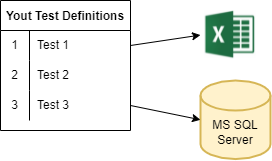

# What is a Test Definition

JC.Unit is a framework focused on testing data. Therefore, it is expected that you will be defining some tests you want to perform. 

Let's have a simple example:

In this example, you have two sources of data you want to test (in real sceanrios you might have lots of them). You want to perform lots of tests againts one data souce or the other, some tests even against both of them (e.g. compare a WorkSheet with a database table).

You have tens of tests, but all of them connect to only two sources of data: one is MS Excel file somewhere on your file system, the other are tables in a MS SQL server database on some server. Tens of tests, only two sources.

JC.Unit distinguishes between *Connection Definitions* and *Test Definitions*. (See also [What is a Connection Definition](../connection-definitions/what-is-connection-definition).)

When you define your tests (on the picture on the left), you *don't* specify all connection details to data sources on each row.

> The *Test Definitions* and *Connection Definitions* are defined separately, in two distinct lists. In *Test Definitions* you refer to *Connection Definitions* by name.

This means, in our example:

* you give a name to the Excel file connection definition, e.g. MyExcel
* you give a name to the SQL Server database you work with, e.g. MyDatabase
* in the test definitions, you refer to these sources using those two names.

The same way you define test, you also define these connections. 

Example of data, that make up a Test Definition:

| Key              | Value                            |
| ---------------- | -------------------------------- |
| TestName         | No errorenous records            |
| TestQuerySource  | MyDatabase                       |
| TestQuery        | SELECT * FROM errorenous_records |
| TestTypeName     | ZeroRows                         |

This is enough information for the system to perform the test. It instructs it to open connection MyDatabase (must be defined in Connection Definitions - that means your [Connection Definition Provider](../connection-definitions/connection-definition-providers) has to return at least one row where name equals "MyDatabase). Then it runs the query. If any row is returned, the test will fail.

Test Definition can have more attributes than in the above example. All of them are listed in this table:

| Attribute | Description | Mandatory |
| --------- | ----------- | --------- |
| TestSuite | Optional. A name which is used for grouping test cases together. | No |
| Order | Optional. Integer value is expected. | No |
| TestCase | Optional. A test case is a specification of the inputs, execution conditions, testing procedure etc. | No |
| TestName | Does not need to be unique. Combination of TestSuite, Order, TestCase and TestName has to be unique | Yes |
| TestDescription | Optional. Description of the test. | No |
| TestQuerySource | One of the values defined in ConnectionName | Depends on TestTypeName |
| TestQuery | A command (e.g. SQL, DAX, …) that can by understand by the given connection type. Or expected value for some test types. | Depends on TestTypeName |
| ReferenceQuerySource | One of values defined in ConnectionName | Depends on TestTypeName |
| ReferenceQuery | A command (e.g. SQL, DAX, …) that can by understand by the given connection type. | Depends on TestTypeName |
| TestTypeName | SameData, RowCount or ZeroRows. Or other type of tests implemented in future. | Yes |
| Tolerance | You can set how much the two values can differ. | No |
| Timeout | Timeout in seconds. | No |

 

--------------------------

## Related Topics:

* You need to define the Connection Definitions somewhere (in local file or in a database) - see [Test Definition Providers](./test-definition-providers). 

